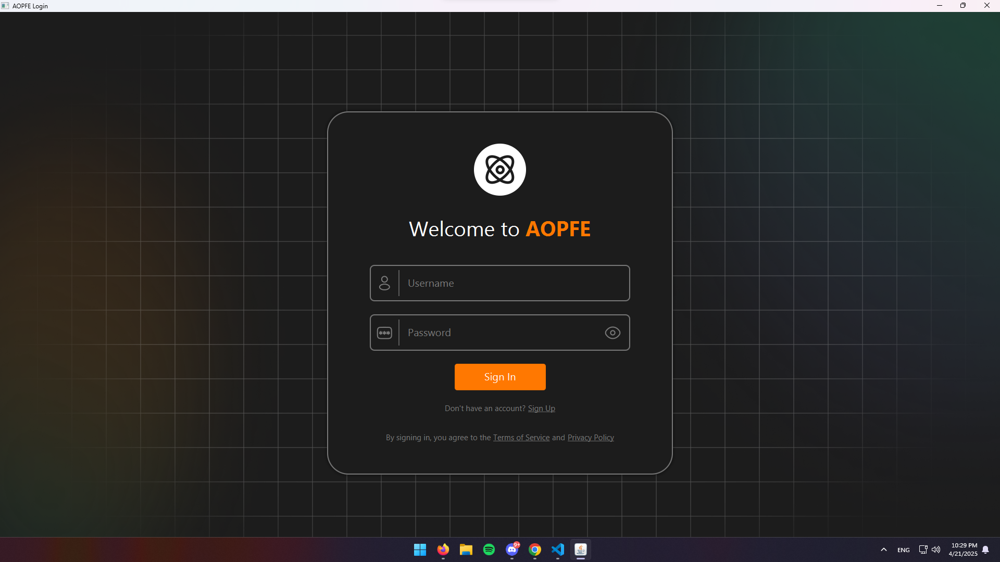
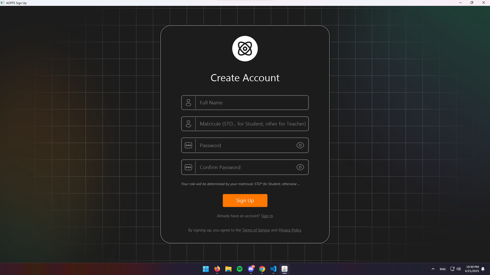
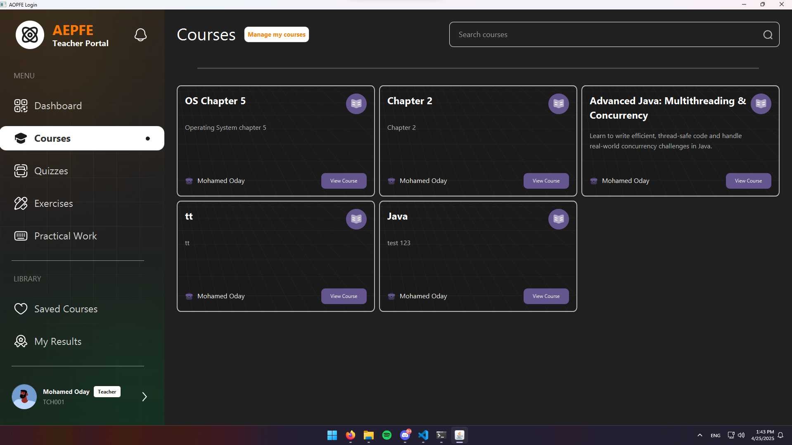
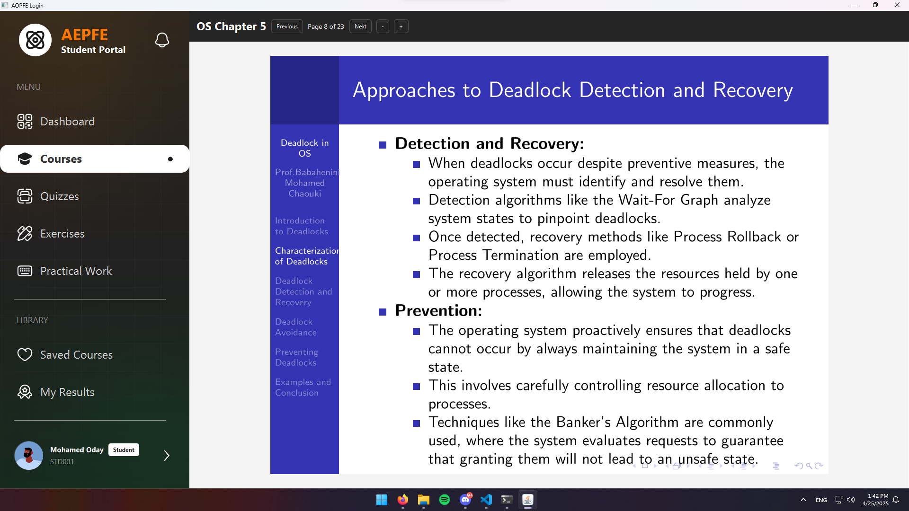
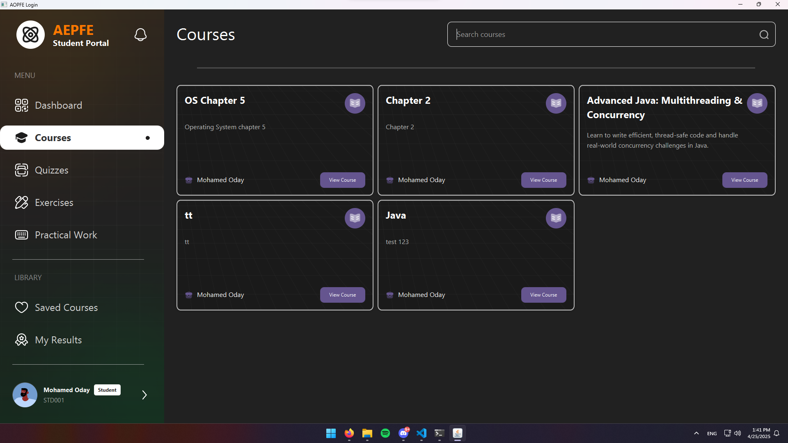
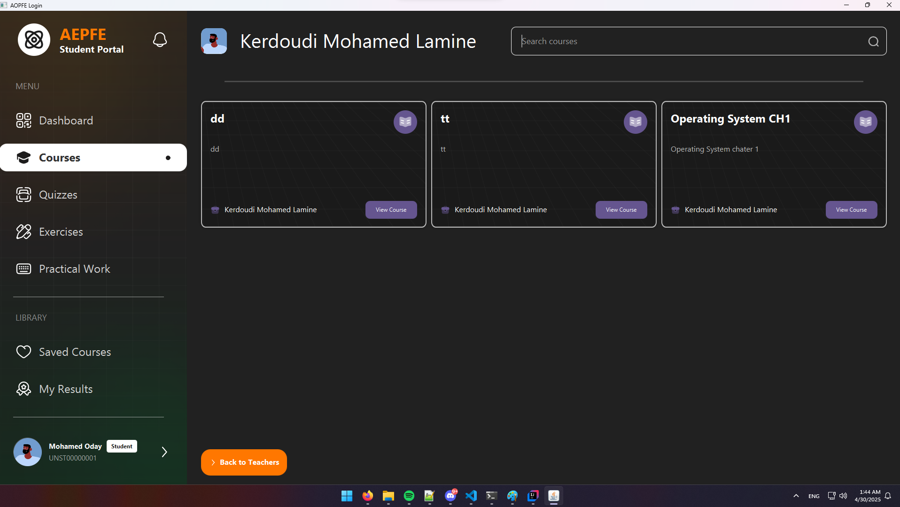
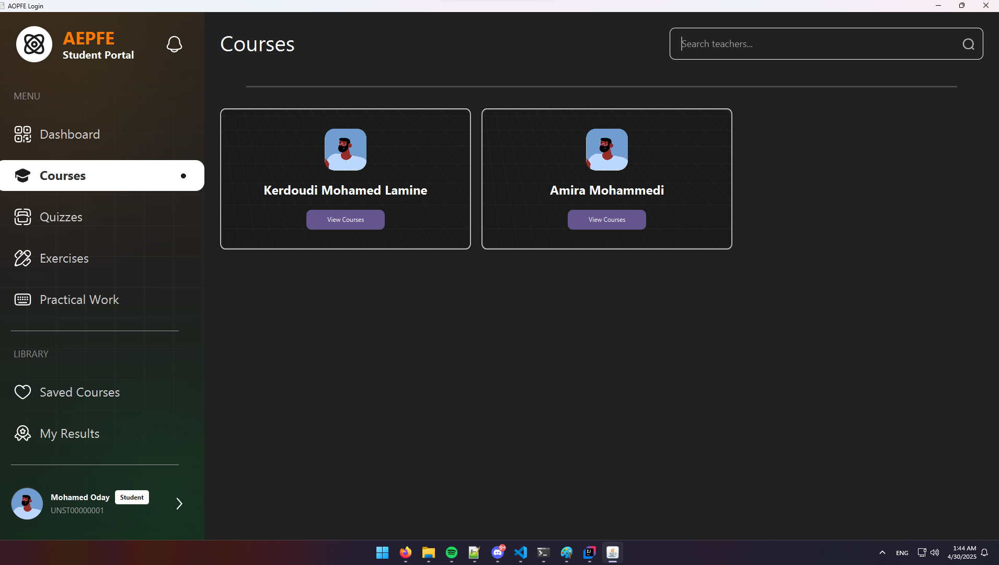
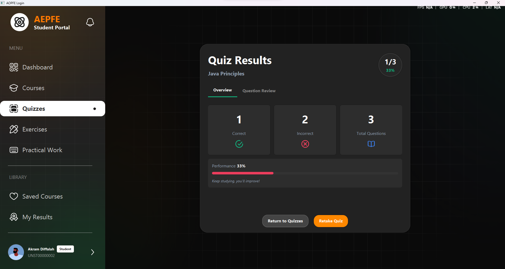
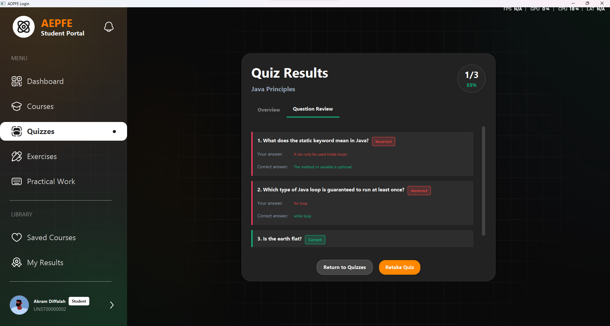

Academic Platform 📚

🚀 Overview
This project is a comprehensive and scalable Academic Platform designed for modern university environments. It streamlines teaching and learning by integrating key functionalities like course management, assessments, and secure user profiling. Inspired by systems like Moodle, it supports role-based access for students and instructors.
Key highlights:

Manage quizzes, assignments, and practical work submissions.
Secure, editable user profiles with hashed authentication and matricule-based validation.
Powered by a relational database for robust backend operations.

The result? A functional, extensible platform that enhances academic collaboration and user experience! 🎓

🤝 Contributing
We welcome contributions!

Fork the repo.
Create a feature branch (git checkout -b feature/AmazingFeature).
Commit changes (git commit -m 'Add some AmazingFeature').
Push to the branch (git push origin feature/AmazingFeature).
Open a Pull Request.

Please follow code style guidelines and add tests where possible.

